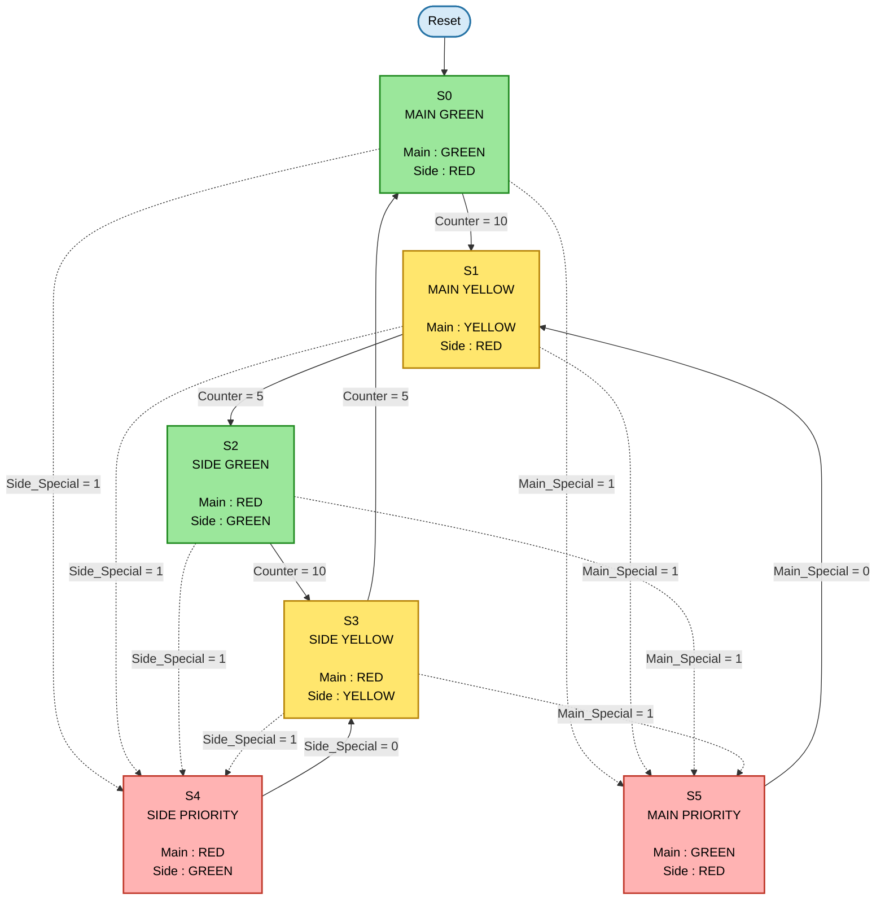
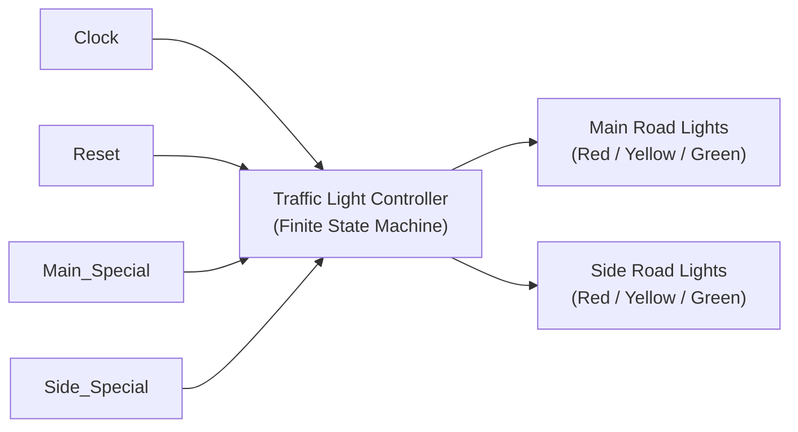
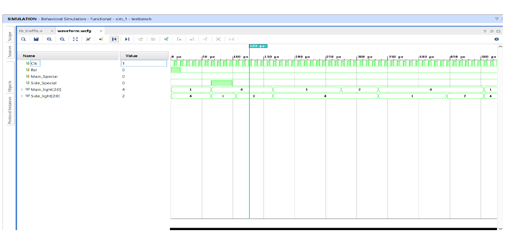

#FPGA-Based Traffic Light Controller using Verilog HDL

An FPGA-based Traffic Light Controller implemented using **Verilog HDL** to manage traffic at a two-road intersection. The controller is designed using a **Finite State Machine (FSM)** and includes **emergency vehicle priority**, allowing ambulances, fire trucks, and police vehicles to receive immediate right of way.

## Project Overview
This project implements a Traffic Light Controller for a two-road intersection using **Verilog HDL** on an **FPGA** platform. The controller is based on a **Finite State Machine (FSM)** that manages the sequence of traffic signals by controlling the green, yellow, and red lights for both roads.

In addition to normal traffic operation, the controller provides priority to emergency vehicles such as ambulances, fire trucks, and police vehicles. When an emergency vehicle is detected on either road, the controller temporarily overrides the normal traffic sequence and immediately provides a green signal to the corresponding road. Once the emergency condition is cleared, the controller resumes its normal traffic cycle.

The design was simulated and verified in **Vivado**, demonstrating correct state transitions, signal timing, and emergency vehicle handling.

## Features

- 🚦 Controls traffic signals for a two-road intersection.
- 🔄 Implements a Finite State Machine (FSM) for traffic signal sequencing.
- 🚑 Provides priority to emergency vehicles such as ambulances, fire trucks, and police vehicles.
- ⏱️ Automatically resumes the normal traffic sequence after emergency handling.
- 💻 Implemented using Verilog HDL for FPGA-based digital design.
- 🧪 Simulated and verified using Vivado.

## Working Principle

The Traffic Light Controller operates using a **Finite State Machine (FSM)** implemented in **Verilog HDL**. The controller continuously monitors the traffic signals and changes the light sequence based on predefined timing intervals.

### Normal Operation

During normal operation, the controller follows a cyclic sequence of traffic light states:

MAIN_GREEN → MAIN_YELLOW → SIDE_GREEN → SIDE_YELLOW → MAIN_GREEN

Each state remains active for a predefined duration before transitioning to the next state.

### Emergency Vehicle Handling

The controller continuously monitors emergency vehicle inputs for both roads.

- If an emergency vehicle is detected on the **main road**, the controller immediately switches the main road signal to **Green**.
- If an emergency vehicle is detected on the **side road**, the controller immediately switches the side road signal to **Green**.
- Once the emergency signal is removed, the controller resumes the normal traffic sequence from the appropriate state.

This design ensures smooth traffic flow while providing immediate priority to emergency vehicles.

### Detailed FSM State Transition Diagram

The following diagram represents the finite state machine (FSM) implemented in the Verilog design. The controller cycles through four normal traffic states. Whenever an emergency vehicle is detected, it immediately switches to the corresponding priority state. After the emergency condition is removed, the FSM resumes the normal traffic sequence.

## Project Architecture

The Traffic Light Controller is designed using a Finite State Machine (FSM) implemented in Verilog HDL. The controller receives clock, reset, and emergency vehicle detection signals as inputs. Based on these inputs and the internal state transitions, it generates the appropriate traffic light signals for the main road and side road.

The following block diagram illustrates the overall architecture of the system.

## FSM State Description

The Traffic Light Controller is implemented as a six-state Finite State Machine (FSM). Each state represents a unique traffic signal configuration for the main road and side road. During normal operation, the controller cycles through the first four states. The remaining two states are used to provide priority to emergency vehicles.

| State | Description | Main Road | Side Road | Transition Condition |
|-------|-------------|-----------|-----------|----------------------|
| **S0** | Main Road Green | 🟢 Green | 🔴 Red | Counter = 10 |
| **S1** | Main Road Yellow | 🟡 Yellow | 🔴 Red | Counter = 5 |
| **S2** | Side Road Green | 🔴 Red | 🟢 Green | Counter = 10 |
| **S3** | Side Road Yellow | 🔴 Red | 🟡 Yellow | Counter = 5 |
| **S4** | Side Road Priority (Emergency) | 🔴 Red | 🟢 Green | `Side_Special = 1` |
| **S5** | Main Road Priority (Emergency) | 🟢 Green | 🔴 Red | `Main_Special = 1` |

### Waveform Analysis

The simulation verifies the following:

- The Clock (Clk) drives the sequential operation of the FSM.
- The Reset (Rst) initializes the controller.
- Main_Special and Side_Special represent emergency vehicle requests.
- Main_light and Side_light change according to the FSM state.
- The controller follows the sequence:
  S0 → S1 → S2 → S3 → S0

